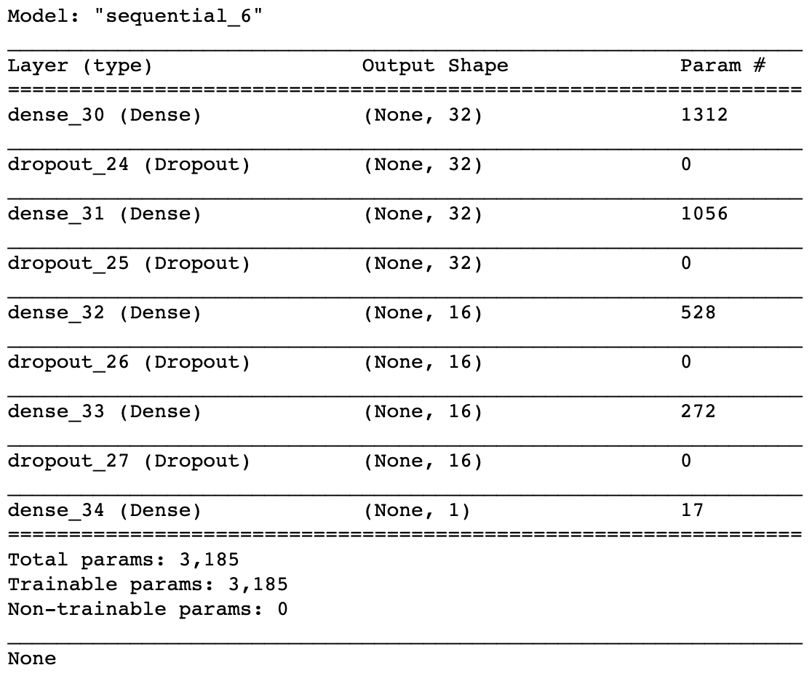
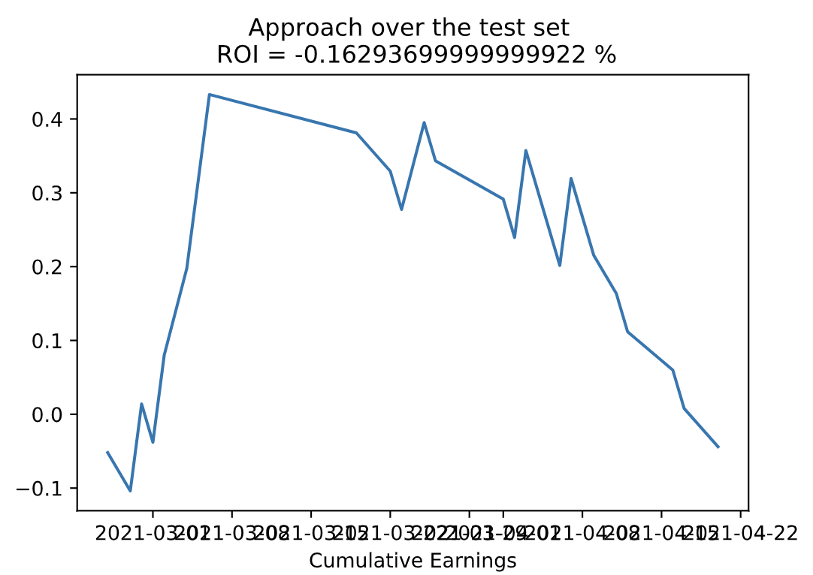
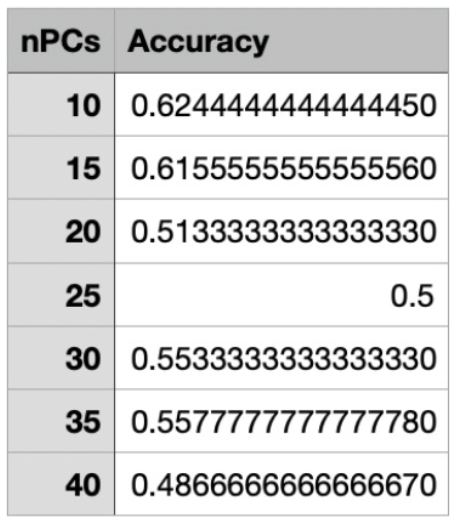

# **Crypto Trading Bot**
## An Automated Technical Analysis-Based Trading Bot

### **Objectives**
1. Use a recursive neural network to trade in multiple cryptocurrency markets
1. Utilize Kraken API to retrieve price information and convert it into time series data
1. Clean the time series data to purge unnecessary information
1. Train our RNN on 65% of that dataset, using 17.5% on validation and the remaining 17.5% on testing.
1. Use the AlphaVantage API to retrieve technical indicator performance for each position in our portfolio at an hourly interval.

### **Technical Indicators To Be Used**
* EMA: Calculated by multiplying the sum of the stock's closing prices during a time period (divided by the number of observations for that period) by a weighting/smoothing multiplier. You would then add that with the previous day's EMA times 1 minus that same multiplier.
	* When price breaks above the EMA, this is an indication of bullish momentum.
	* When price breaks below the EMA, this is an indication of bearish momentum.
* RSI: An oscillator that has a reading from 0 to 100. Developed by J. Welles Wilder in 1978, and used to identify overbought and oversold conditions in the market.
    * Overbought conditions occurs above the 70 percentile.
    * Oversold conditions occurs below the 30 percentile.
	* Compares sizes of recent profits to recent losses in order to determine an asset's fair value in relation to current price.
	* By default is calculated with a period of 14.
	
* JWWMA: An indicator much like the EMA, however; while standard EMAs have an EMA% of 13.3(2/15) for 14 days, J. Welles Wilder uses an EMA% of 7.1 (1/14)
	* Primarily used when calculating average true range.
* ATR: This is a volatility indicator that measures movement potential by comparing the range of each passing day.
    * Useful for determining reasonable stop losses.
    

# Deep Learning Model
* After adding the above features to the dataset, we built a neural network to try and predict buy and sell signals based on the stoploss and take profit percentages we defined. For stoploss, we will not accept greater than a 5% loss. For the take profit, we will not accept lower than 12% gain.
* We wanted to build a model that would accurately predict these signals using the features we added to the dataset.
* In order to achieve this, we built a function that allowed us to create 7 separate models based on a different number of principal components. This allowed us to evaluate multiple models at once to determine which architecture was most fitting.

## Model Architecture
* For the model architecture, we started with a Sequential model comprised of dense layers that used the "relu" activation function. We chose this architecture because the relu function allows for more adaptability in the model and more closely follows the function of the human neural network. Given the amount of features in our dataset, we believed that this would be the best method of approach for the model.
* We used four hidden layers in our model with the first two layers having a shape of 32 and the last two layers having a shape of 16. We based this approach on research we did on the performance of similar trading bots that others have built. This was the most effective model in those cases.
* Lastly, for our output layer we used Sigmoid for activation, Adam for the optimizer, and binary cross-entropy for loss. We chose binary cross entropy because the signal we are predicting gives a result of either 1 or 0.

# Conclusive Findings
* Our original intent was to deploy a fully-loaded trading bot that would be able to take consistent 12% profits. However, with a resulting loss of 0.16%, it's clear that there is room for improvement in the model. Perhaps more testing on a larger dataset is necessary to increase the ROI of the model.
* After Backtesting our model, our estimated ROI was -0.16%. While this does beat the random walk on bullish trades, there is definitely room for improvement in the model.

* Additionally, when loading our models, the accuracy score of the models decreased as we added more principal components to the test set.

### **Future improvements and limitations**
With the conclusion of this project, we've realized a myriad of ways in which we can imporve our crypto trading bot.
* We could merge multiple indicators into one unified trading strategy, leaving the neural network with only one decision to make, versus multiple stacked layers.
* Consider trading on bearish predictions instead of limiting our scope to only bullish trends.
* We could fully implement our ATR-based trailing stop loss, in order to maximize profits
* Test with multiple metrics such as volatility, market cap, and position size into account.
* Test the bot in live trading environments.

# Summary
We originally hypothesized that we could use a RNN to accurately predict buy and sell signals on various Cryptocurrencies. We cleaned our dataset and created a model that is capable of identifying trends based on its own technical analysis. We did run into some issues, such as: Finding a method to run, save, and load multiple models, pickling of keras models, adjusting the models to make them more accurate, and applying our bot to other cryptocurrencies within the given time frame. Another limitation was the fact that we paper backtested our work. Statistically speaking, all backtesting simulations are fundamentally incorrect as there is no real affect on the market. Live trading environments are aftected by each and every decision made by our trading bot, which has an unknown magnitude of effects on our profits/losses. But with a ROI of only -0.16%, it just goes to show that we are rather close to creating a profiting model. A few tweaks to the dataset and model will yield much more satisfactory results.